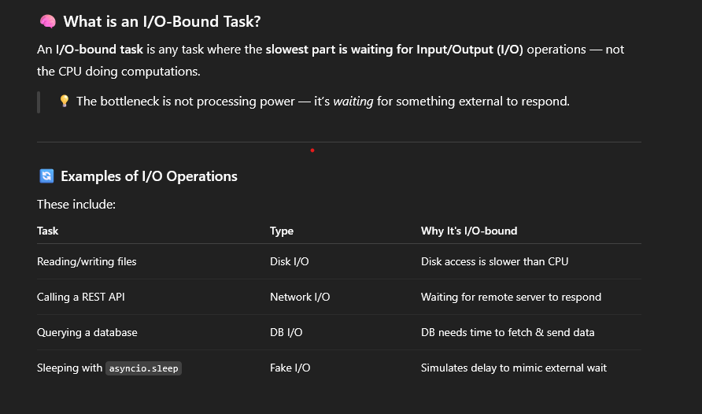
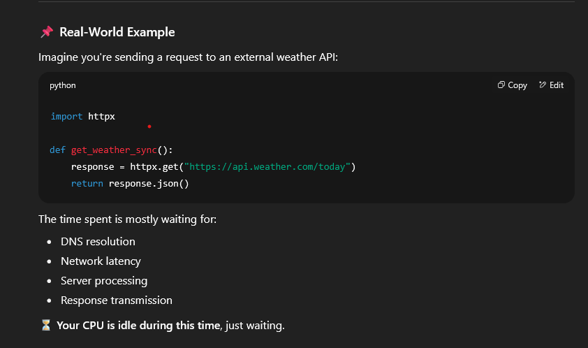

# FastAPI ML - Iris Species Classifier

A machine learning API built with FastAPI that predicts Iris flower species based on sepal and petal measurements. This project demonstrates both synchronous and asynchronous API patterns, making it ideal for learning about FastAPI performance characteristics and ML model deployment.

## 🌟 Features

- **Machine Learning Model**: RandomForest classifier trained on the classic Iris dataset
- **RESTful API**: Clean, well-documented endpoints using FastAPI
- **Async/Sync Comparison**: Demonstrates the performance differences between synchronous and asynchronous operations
- **Load Testing**: Built-in concurrent request testing
- **Type Safety**: Full Pydantic schema validation
- **Auto Documentation**: Interactive API docs with Swagger UI

## 📁 Project Structure

```
Fastapi_ml/
├── app/
│   ├── main.py           # Main FastAPI application with ML endpoints
│   ├── async_demo.py     # Async vs Sync performance demo
│   ├── schemas.py        # Pydantic models for request/response validation
│   └── __pycache__/
├── model/
│   ├── train_model.py    # Script to train and save the ML model
│   └── iris_model.joblib # Trained RandomForest model (generated)
├── env/                  # Virtual environment
├── requirements.txt      # Python dependencies
├── load_test.py         # Concurrent request testing script
├── Io_bound_task.png    # Performance comparison diagram
├── Io_example_api.png   # API usage example
└── README.md           # This file
```

## 🚀 Quick Start

### Prerequisites

- Python 3.8+
- pip (Python package manager)

### Installation

1. **Clone the repository**
   ```bash
   git clone https://github.com/TAHMID37/Fastapi_ML.git
   cd Fastapi_ML
   ```

2. **Create and activate virtual environment**
   ```powershell
   # On Windows PowerShell
   python -m venv env
   Set-ExecutionPolicy -ExecutionPolicy RemoteSigned -Scope CurrentUser
   .\env\Scripts\activate
   
   # On Linux/Mac
   python -m venv env
   source env/bin/activate
   ```

3. **Install dependencies**
   ```bash
   pip install -r requirements.txt
   ```

4. **Train the model** (if not already present)
   ```bash
   python model/train_model.py
   ```

5. **Run the API server**
   ```bash
   # For the main ML API
   uvicorn app.main:app --reload
   
   # Or for the async/sync demo
   uvicorn app.async_demo:app --reload
   ```

6. **Access the API**
   - API: http://127.0.0.1:8000
   - Interactive docs: http://127.0.0.1:8000/docs
   - ReDoc: http://127.0.0.1:8000/redoc

## 📖 API Endpoints

### Main ML API (`app.main`)

| Method | Endpoint | Description |
|--------|----------|-------------|
| GET | `/health` | Health check endpoint |
| GET | `/info` | Model information |
| POST | `/predict` | Predict Iris species |

### Async Demo API (`app.async_demo`)

| Method | Endpoint | Description |
|--------|----------|-------------|
| GET | `/sync` | Synchronous operation (5s delay) |
| GET | `/async` | Asynchronous operation (5s delay) |

## 🔬 Usage Examples

### Making Predictions

```bash
# Using curl
curl -X POST "http://127.0.0.1:8000/predict" \
     -H "Content-Type: application/json" \
     -d '{
       "sepal_length": 5.1,
       "sepal_width": 3.5,
       "petal_length": 1.4,
       "petal_width": 0.2
     }'
```

```python
# Using Python requests
import requests

data = {
    "sepal_length": 5.1,
    "sepal_width": 3.5,
    "petal_length": 1.4,
    "petal_width": 0.2
}

response = requests.post("http://127.0.0.1:8000/predict", json=data)
print(response.json())
# Output: {"predicted_class": "setosa"}
```

### Load Testing

Run the included load test to compare async vs sync performance:

```bash
python load_test.py
```

This will send 5 concurrent requests to both endpoints and show the performance difference.

## 🧠 Model Details

- **Algorithm**: Random Forest Classifier
- **Dataset**: Iris flower dataset (150 samples, 4 features)
- **Features**: 
  - Sepal length (cm)
  - Sepal width (cm)
  - Petal length (cm)
  - Petal width (cm)
- **Classes**: setosa, versicolor, virginica
- **Accuracy**: ~96% on test set

## ⚡ Performance Insights

This project demonstrates the key differences between synchronous and asynchronous operations:

- **Sync Endpoints**: Block the entire event loop during I/O operations
- **Async Endpoints**: Allow other requests to be processed concurrently
- **Practical Impact**: Async endpoints can handle multiple requests simultaneously, while sync endpoints process them sequentially

See the included load test results and diagrams for performance comparisons.

## 🛠️ Development

### Adding New Features

1. **New ML Models**: Add training scripts in `model/` directory
2. **New Endpoints**: Add routes in `app/main.py`
3. **Schema Changes**: Update `app/schemas.py` for request/response models

### Running Tests

```bash
# Load testing
python load_test.py

# Model training
python model/train_model.py
```

## 📦 Dependencies

- **fastapi**: Modern, fast web framework for building APIs
- **uvicorn**: ASGI server for running FastAPI applications
- **scikit-learn**: Machine learning library for model training
- **joblib**: Efficient serialization for ML models
- **numpy**: Numerical computing library
- **pydantic**: Data validation using Python type hints
- **httpx**: Async HTTP client for testing

## 🤝 Contributing

1. Fork the repository
2. Create a feature branch (`git checkout -b feature/amazing-feature`)
3. Commit your changes (`git commit -m 'Add some amazing feature'`)
4. Push to the branch (`git push origin feature/amazing-feature`)
5. Open a Pull Request

## 📝 License

This project is open source and available under the [MIT License](LICENSE).

## 🔗 Links

- [FastAPI Documentation](https://fastapi.tiangolo.com/)
- [Scikit-learn Documentation](https://scikit-learn.org/)
- [Uvicorn Documentation](https://www.uvicorn.org/)

## 📸 Screenshots


*Performance comparison between sync and async endpoints*


*Example API usage and response*

---

**Author**: [TAHMID37](https://github.com/TAHMID37)  
**Project**: FastAPI ML Iris Classifier  
**Last Updated**: August 2025